# APS I - Guia de Estudo + Lista 01 Resolvida

Material organizado a partir dos arquivos enviados, com foco no que o trabalho pede, na resolução da **Lista 01** e no resumo do conteúdo para estudo da prova.

**Convenção usada:** atributos com `/` indicam relacionamentos/atributos derivados, como o enunciado pede em algumas questões.

## 1. O que o trabalho pede

### Regras gerais
- O trabalho pode ser feito individualmente ou em dupla.
- Prazo de entrega: **14/04/2026 até 23h59**.
- Envio por e-mail do professor ou pelo Blackboard/Fórum da disciplina.

### Parte I - Artefatos da Lista 01
- Resolver **as 11 questões da Lista 01**.
- Desenhar os diagramas de classes de todas as questões, com **classes, atributos e métodos**.
- Especificar em arquivo TXT os **requisitos funcionais e não funcionais** de cada questão.
- Publicar tudo no GitHub com um `README.md` detalhando as respostas.

### Parte II - Aplicações
- Construir projetos WEB para as questões 01 a 11.
- Gerar o código com apoio de IA generativa.
- Usar **Python + Streamlit**.
- Testar interface e banco de dados, quando necessário.
- Publicar os projetos no mesmo GitHub da análise e dos diagramas.

## 2. Observação sobre o GitHub da aluna

- O repositório da aluna está bem organizado por pastas, uma por questão, com README central.
- Ele pode servir como referência de estrutura de repositório e documentação.
- Mas há duas diferenças importantes em relação ao seu enunciado: o README diz que os projetos foram feitos em React/Vite/JavaScript/CSS, enquanto o seu trabalho pede aplicações em Python Streamlit; além disso, a questão 11 do repositório aparece como 'Dashboard Corporativo', mas na sua Lista 01 a questão 11 é 'Herança'.
- Conclusão: use o GitHub como inspiração de organização, não como cópia literal da entrega.

## 3. Lista 01 resolvida

### Questão 01 - Conta de Luz

**Cenário resumido:** Controle mensal de consumo de energia de Gabriel, registrando leitura, KW gasto, valor a pagar, pagamento e média; deve permitir identificar o mês de menor e de maior consumo.

**Classes, atributos e métodos sugeridos:**

**ContaLuz**

Atributos:
- dataLeitura: Date
- numeroLeitura: Integer
- kwGasto: Decimal
- valorPagar: Decimal
- dataPagamento: Date
- mediaConsumo: Decimal
- /mesReferencia: String

Métodos:
- calcularMediaConsumo(): Decimal
- registrarPagamento(data: Date)
- obterMesReferencia(): String

**ControleContaLuz**

Atributos:
- /contas: Colecao<ContaLuz>

Métodos:
- adicionarConta(conta: ContaLuz)
- obterMenorConsumo(): ContaLuz
- obterMaiorConsumo(): ContaLuz
- listarContas(): Colecao<ContaLuz>

**Relacionamentos / observações:**
- ControleContaLuz 1 --- * ContaLuz

**Requisitos funcionais:**
- Permitir cadastrar uma conta de luz mensal.
- Permitir consultar o histórico de contas cadastradas.
- Calcular e exibir a média de consumo da conta.
- Identificar o mês de menor consumo.
- Identificar o mês de maior consumo.
- Registrar a data de pagamento da conta.

**Requisitos não funcionais:**
- Interface simples para uso pessoal.
- Precisão decimal para valores monetários e consumo.
- Persistência dos dados para consultas mensais.
- Baixo tempo de resposta para geração das consultas.

**Diagrama textual (Mermaid):**

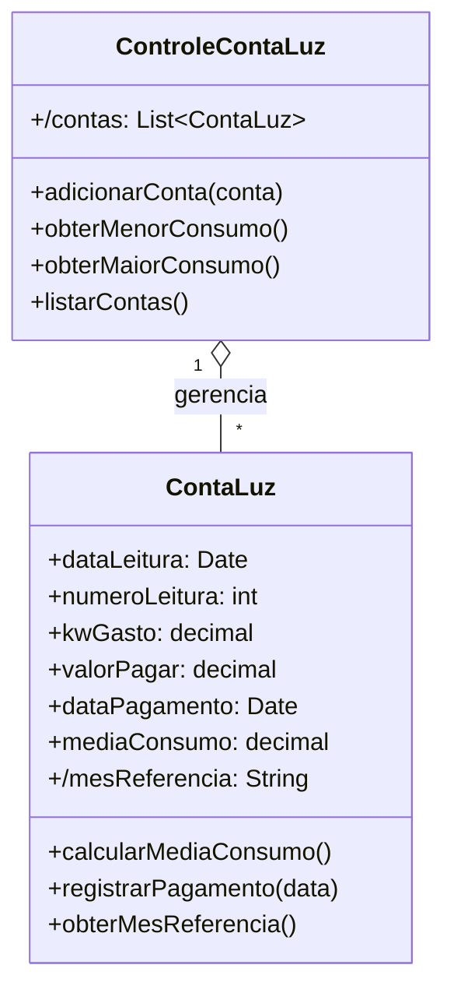

### Questão 02 - Classe TextoSaida

**Cenário resumido:** Classe para configurar um texto por atributos visuais, escolhendo tipo de componente (label, edit ou memo) e cores de fonte/fundo.

**Classes, atributos e métodos sugeridos:**

**TextoSaida**

Atributos:
- texto: String
- tamanhoLetra: Integer
- corFonte: Cor
- corFundo: Cor
- tipoComponente: TipoComponente

Métodos:
- definirTexto(texto: String)
- alterarTamanhoLetra(tamanho: Integer)
- alterarCorFonte(cor: Cor)
- alterarCorFundo(cor: Cor)
- definirTipoComponente(tipo: TipoComponente)
- exibir()

**Relacionamentos / observações:**
- TextoSaida usa os tipos enumerados Cor e TipoComponente.

**Requisitos funcionais:**
- Permitir informar o texto a ser exibido.
- Permitir configurar tamanho da letra.
- Permitir configurar cor da fonte.
- Permitir configurar cor do fundo.
- Permitir escolher o componente de exibição.
- Exibir o texto formatado conforme a configuração.

**Requisitos não funcionais:**
- Somente cores previamente definidas devem ser aceitas.
- A interface de configuração deve ser intuitiva.
- A formatação deve ser aplicada imediatamente após a alteração.

**Diagrama textual (Mermaid):**

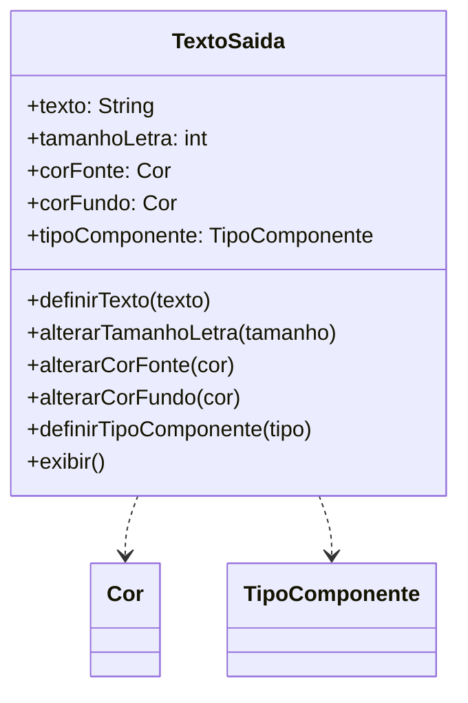

### Questão 03 - Classe Boneco em Movimento

**Cenário resumido:** Classe de um boneco com nome, posição X/Y e direção atual, capaz de se movimentar na tela.

**Classes, atributos e métodos sugeridos:**

**Boneco**

Atributos:
- nome: String
- posicaoX: Integer
- posicaoY: Integer
- direcaoAtual: Direcao

Métodos:
- moverCima()
- moverBaixo()
- moverDireita()
- moverEsquerda()
- mudarDirecao(direcao: Direcao)
- obterPosicao(): String

**Relacionamentos / observações:**
- Boneco usa o tipo enumerado Direcao.

**Requisitos funcionais:**
- Permitir definir nome do boneco.
- Permitir armazenar posição horizontal e vertical.
- Permitir alterar a direção atual.
- Permitir mover o boneco para cima, baixo, esquerda e direita.
- Permitir consultar a posição atual.

**Requisitos não funcionais:**
- Movimentação deve ser imediata.
- As direções permitidas devem ser limitadas aos quatro sentidos informados.
- A modelagem deve ser simples e reutilizável.

**Diagrama textual (Mermaid):**

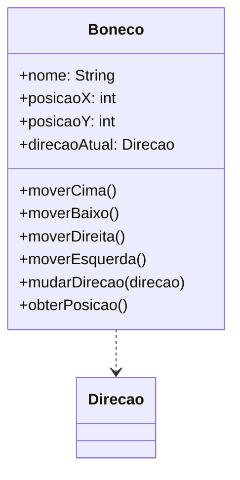

### Questão 04 - Horario de Remedios

**Cenário resumido:** Aplicação pessoal de controle de remédios com sugestão de horários, escolha do melhor horário, geração de planilha diária e reorganização em caso de atraso.

**Classes, atributos e métodos sugeridos:**

**Paciente**

Atributos:
- nome: String

Métodos:
- cadastrar()

**Remedio**

Atributos:
- nomeRemedio: String
- dosagem: String
- dataInicio: Date
- quantidadeDias: Integer
- vezesAoDia: Integer
- /dataFim: Date
- /paciente: Paciente
- /horarios: Colecao<HorarioMedicacao>

Métodos:
- calcularDataFim(): Date
- sugerirHorariosPossiveis(): Colecao<HorarioMedicacao>
- definirHorarios(horarios: Colecao<HorarioMedicacao>)

**HorarioMedicacao**

Atributos:
- data: Date
- horaPrevista: Time
- horaReal: Time
- tomado: Boolean

Métodos:
- registrarToma(horaReal: Time)
- reagendar(novaHora: Time)

**PlanilhaHorarios**

Atributos:
- dataReferencia: Date
- /itens: Colecao<HorarioMedicacao>

Métodos:
- gerarDoDia(): Colecao<HorarioMedicacao>
- reorganizarDoDia()

**Relacionamentos / observações:**
- Paciente 1 --- * Remedio
- Remedio 1 --- * HorarioMedicacao
- PlanilhaHorarios 1 --- * HorarioMedicacao

**Requisitos funcionais:**
- Permitir cadastrar o remédio, dosagem e duração do tratamento.
- Permitir informar a quantidade de vezes ao dia.
- Sugerir horários possíveis de administração.
- Permitir ao usuário escolher os horários desejados.
- Calcular automaticamente a data final do tratamento.
- Gerar planilha diária de horários.
- Reorganizar os horários do dia em caso de atraso.

**Requisitos não funcionais:**
- Aplicação deve ser adequada ao uso em smartphone.
- Horários devem ser exibidos de forma clara e legível.
- Reorganização deve ocorrer rapidamente.
- Os dados do tratamento devem permanecer salvos.

**Diagrama textual (Mermaid):**

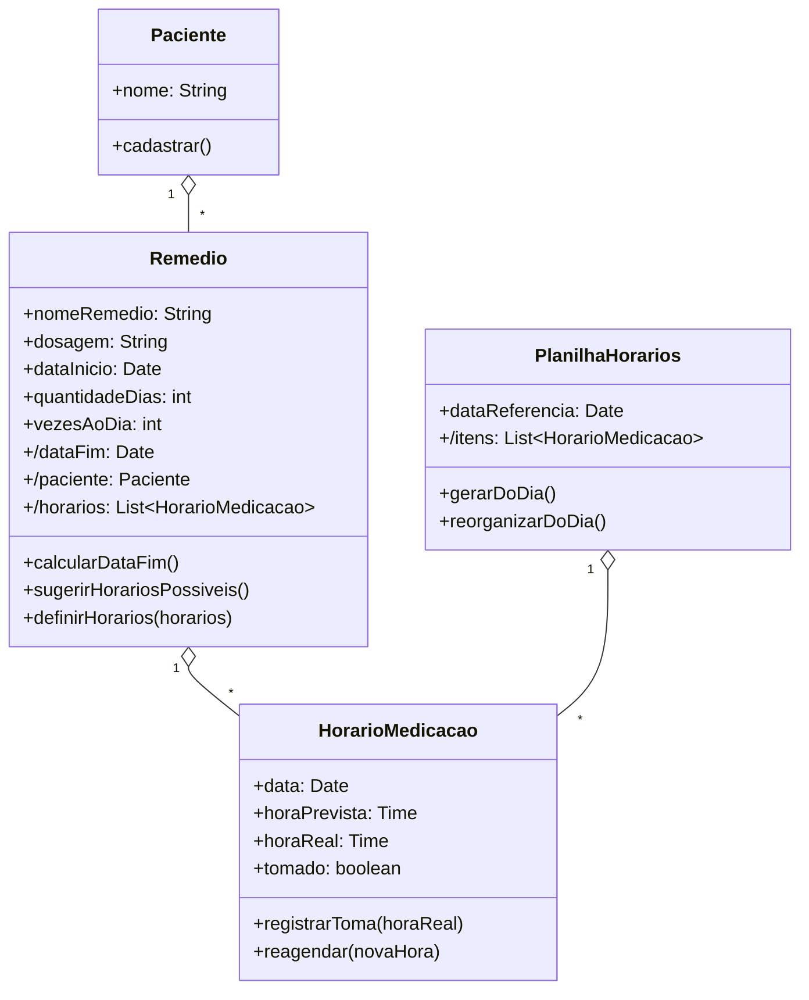

### Questão 05 - Gastos Diarios

**Cenário resumido:** Planilha de Vera para registrar gastos por tipo, data, valor e forma de pagamento; ao final do mês gera total agrupado por tipo e por forma de pagamento.

**Classes, atributos e métodos sugeridos:**

**Gasto**

Atributos:
- tipo: TipoGasto
- dataGasto: Date
- valor: Decimal
- formaPagamento: FormaPagamento

Métodos:
- cadastrar()
- obterMesReferencia(): String

**ControleGastos**

Atributos:
- /gastos: Colecao<Gasto>

Métodos:
- adicionarGasto(gasto: Gasto)
- totalizarPorMes(mes: String): Decimal
- totalizarPorTipo(): Mapa
- totalizarPorFormaPagamento(): Mapa
- emitirRelatorioMensal()

**Relacionamentos / observações:**
- ControleGastos 1 --- * Gasto

**Requisitos funcionais:**
- Permitir cadastrar um gasto diário.
- Permitir classificar o gasto por tipo.
- Permitir classificar o gasto por forma de pagamento.
- Listar os gastos de um determinado mês.
- Totalizar gastos por tipo.
- Totalizar gastos por forma de pagamento.
- Emitir relatório mensal consolidado.

**Requisitos não funcionais:**
- Valores devem usar precisão monetária.
- A consulta mensal deve ser simples.
- Os filtros por mês devem ter resposta rápida.

**Diagrama textual (Mermaid):**

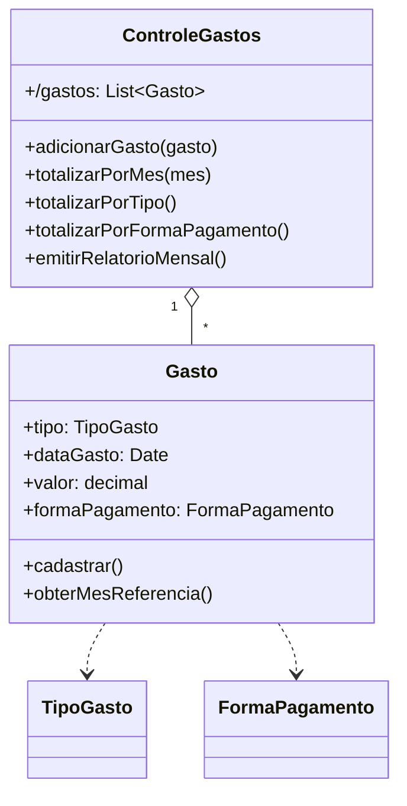

### Questão 06 - Comanda Eletronica (PDV)

**Cenário resumido:** Aplicação de padaria para registrar em uma comanda numerada os produtos consumidos e suas quantidades, finalizando a compra no caixa com cálculo do valor total.

**Classes, atributos e métodos sugeridos:**

**Produto**

Atributos:
- codigo: Integer
- nome: String
- valorUnitario: Decimal

Métodos:
- obterValorUnitario(): Decimal

**ItemComanda**

Atributos:
- quantidade: Integer
- /produto: Produto
- /subtotal: Decimal

Métodos:
- calcularSubtotal(): Decimal

**Comanda**

Atributos:
- numero: Integer
- status: String
- /itens: Colecao<ItemComanda>
- /valorTotal: Decimal

Métodos:
- registrarConsumo(produto: Produto, quantidade: Integer)
- calcularValorTotal(): Decimal
- finalizarCompra()
- listarItens()

**Relacionamentos / observações:**
- Comanda 1 --- * ItemComanda
- ItemComanda * --- 1 Produto

**Requisitos funcionais:**
- Permitir abrir uma comanda numerada.
- Permitir registrar produto e quantidade consumida.
- Permitir listar os itens registrados na comanda.
- Calcular subtotal por item.
- Calcular valor total da compra.
- Finalizar a compra no caixa.

**Requisitos não funcionais:**
- Baixo tempo de resposta no atendimento do caixa.
- Precisão monetária no cálculo dos valores.
- Facilidade de uso para atendentes e caixas.

**Diagrama textual (Mermaid):**

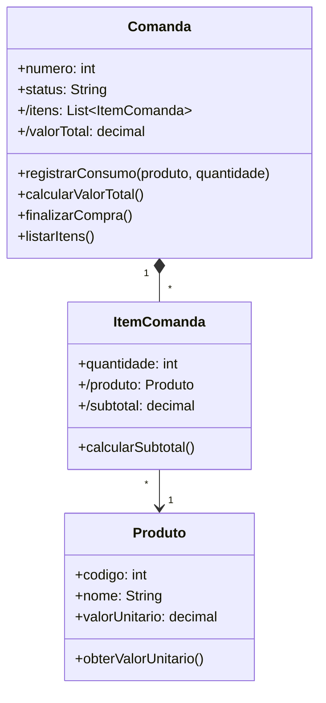

### Questão 07 - Lista de Compras

**Cenário resumido:** Lista mensal de compras de Carolina com produto, unidade, quantidade do mês, quantidade efetiva de compra e preço estimado; gera total estimado.

**Classes, atributos e métodos sugeridos:**

**Produto**

Atributos:
- nome: String
- unidadeCompra: String
- precoEstimado: Decimal

Métodos:
- atualizarPrecoEstimado(novoPreco: Decimal)

**ItemListaCompra**

Atributos:
- quantidadeMes: Decimal
- quantidadeCompra: Decimal
- /produto: Produto
- /subtotalEstimado: Decimal

Métodos:
- calcularSubtotalEstimado(): Decimal
- ajustarQuantidadeCompra(qtd: Decimal)

**ListaCompraMensal**

Atributos:
- mesReferencia: String
- /itens: Colecao<ItemListaCompra>
- /totalEstimado: Decimal

Métodos:
- adicionarItem(item: ItemListaCompra)
- calcularTotalEstimado(): Decimal
- listarItens()

**Relacionamentos / observações:**
- ListaCompraMensal 1 --- * ItemListaCompra
- ItemListaCompra * --- 1 Produto

**Requisitos funcionais:**
- Permitir cadastrar produtos da lista mensal.
- Permitir informar unidade de compra.
- Permitir registrar quantidade prevista e quantidade efetiva.
- Permitir atualizar o preço estimado do produto.
- Calcular subtotal estimado por item.
- Calcular total estimado da lista.
- Listar os itens da compra do mês.

**Requisitos não funcionais:**
- Suporte a quantidades fracionadas.
- Precisão decimal em preços e totais.
- Interface simples, adequada a uso doméstico.

**Diagrama textual (Mermaid):**

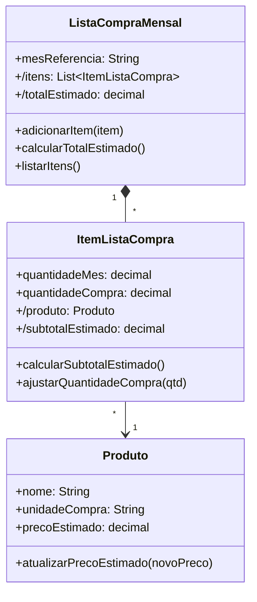

### Questão 08 - Colecao de CDs

**Cenário resumido:** Cadastro da coleção de CDs de Adriano, informando artista, título do CD e ano de lançamento.

**Classes, atributos e métodos sugeridos:**

**Artista**

Atributos:
- nome: String

Métodos:
- cadastrar()

**CD**

Atributos:
- titulo: String
- anoLancamento: Integer
- /artista: Artista

Métodos:
- cadastrar()
- obterDescricao(): String

**ColecaoCD**

Atributos:
- /cds: Colecao<CD>

Métodos:
- adicionarCD(cd: CD)
- listarCDs()
- pesquisarPorTitulo(titulo: String)

**Relacionamentos / observações:**
- ColecaoCD 1 --- * CD
- CD * --- 1 Artista

**Requisitos funcionais:**
- Permitir cadastrar artista.
- Permitir cadastrar CD com título e ano.
- Permitir associar um artista a um CD.
- Listar CDs cadastrados.
- Pesquisar CD pelo título.

**Requisitos não funcionais:**
- Cadastro simples e rápido.
- Persistência da coleção para consulta posterior.
- Ordenação e pesquisa com baixo tempo de resposta.

**Diagrama textual (Mermaid):**

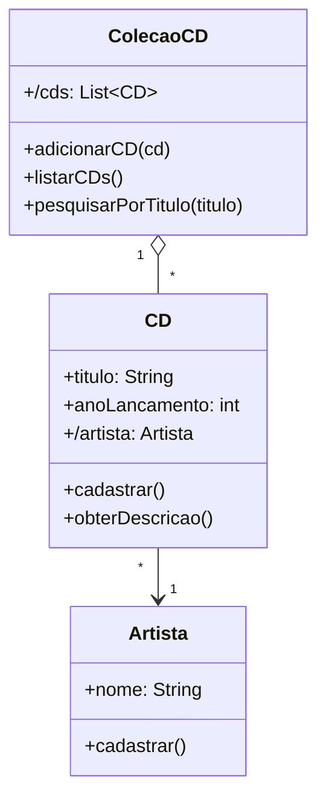

### Questão 09 - Colecao de CDs (Variacao A)

**Cenário resumido:** Coleção com CDs normais ou coletâneas, múltiplos músicos por CD, músicas/faixas e relatórios de CDs por músico e de CDs que contêm determinada música.

**Classes, atributos e métodos sugeridos:**

**Artista**

Atributos:
- nome: String

Métodos:
- cadastrar()

**Musica**

Atributos:
- titulo: String

Métodos:
- cadastrar()

**Faixa**

Atributos:
- numero: Integer
- duracao: String
- /musica: Musica

Métodos:
- cadastrar()

**CD**

Atributos:
- titulo: String
- anoLancamento: Integer
- coletanea: Boolean
- duplo: Boolean
- /artistas: Colecao<Artista>
- /faixas: Colecao<Faixa>

Métodos:
- adicionarArtista(artista: Artista)
- adicionarFaixa(faixa: Faixa)
- listarFaixas()

**ColecaoCD**

Atributos:
- /cds: Colecao<CD>

Métodos:
- adicionarCD(cd: CD)
- listarCDsPorArtista(nome: String)
- listarCDsPorMusica(titulo: String)

**Relacionamentos / observações:**
- ColecaoCD 1 --- * CD
- CD * --- * Artista
- CD 1 --- * Faixa
- Faixa * --- 1 Musica

**Requisitos funcionais:**
- Permitir cadastrar CDs com indicador de coletânea e de CD duplo.
- Permitir associar vários artistas a um CD.
- Permitir cadastrar músicas/faixas de cada CD.
- Permitir registrar a duração de cada faixa.
- Permitir listar CDs de um determinado músico.
- Permitir consultar em quais CDs está determinada música.

**Requisitos não funcionais:**
- Suporte a relacionamentos muitos-para-muitos.
- Pesquisa textual rápida por músico e música.
- Dados devem permanecer consistentes entre CD, faixa e música.

**Diagrama textual (Mermaid):**

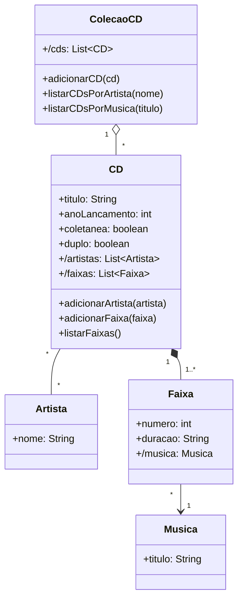

### Questão 10 - Sala de Reuniao

**Cenário resumido:** Controle de três salas de reunião, com funcionários, cargo, ramal, agendamento, realocação e consulta de salas livres por data/faixa de horário; cada sala tem capacidade.

**Classes, atributos e métodos sugeridos:**

**Funcionario**

Atributos:
- nome: String
- cargo: String
- ramal: String

Métodos:
- cadastrar()

**SalaReuniao**

Atributos:
- numero: String
- capacidadeLugares: Integer

Métodos:
- cadastrar()
- estaDisponivel(data: Date, inicio: Time, fim: Time): Boolean

**Reuniao**

Atributos:
- assunto: String
- data: Date
- horaInicio: Time
- horaFim: Time
- /solicitante: Funcionario
- /sala: SalaReuniao

Métodos:
- agendar()
- realocar(novaSala: SalaReuniao, novaData: Date, novaHoraInicio: Time, novaHoraFim: Time)

**AgendaReunioes**

Atributos:
- /reunioes: Colecao<Reuniao>

Métodos:
- agendarReuniao(reuniao: Reuniao)
- realocarReuniao(reuniao: Reuniao, novaSala: SalaReuniao, novaData: Date, novaHoraInicio: Time, novaHoraFim: Time)
- consultarSalasLivres(data: Date, inicio: Time, fim: Time): Colecao<SalaReuniao>

**Relacionamentos / observações:**
- AgendaReunioes 1 --- * Reuniao
- Funcionario 1 --- * Reuniao
- SalaReuniao 1 --- * Reuniao (ao longo do tempo)
- Restrição: uma sala só pode ter 0..1 reunião na mesma faixa de horário.

**Requisitos funcionais:**
- Permitir cadastrar salas de reunião com capacidade.
- Permitir cadastrar funcionários com cargo e ramal.
- Permitir agendar reunião com assunto, data e horário.
- Permitir associar uma reunião a uma sala e a um funcionário solicitante.
- Permitir realocar reunião, alterando sala, data e/ou horário.
- Consultar salas livres por data e faixa de horário.
- Exibir a agenda diária das salas.

**Requisitos não funcionais:**
- O sistema deve impedir conflitos de horário.
- Consultas de disponibilidade devem ser rápidas.
- Interface deve facilitar visualização da agenda por dia.
- Persistência dos agendamentos é obrigatória.

**Diagrama textual (Mermaid):**

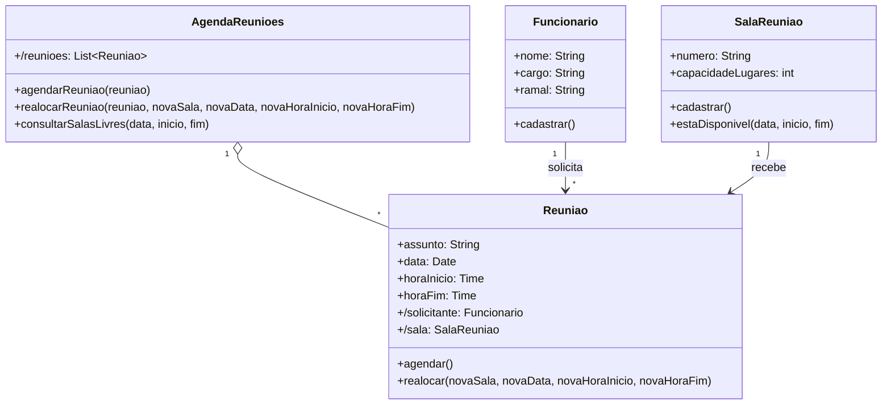

### Questão 11 - Heranca

**Cenário resumido:** Refatorar as classes Funcionario e Cliente criando uma superclasse com atributos e métodos comuns.

**Classes, atributos e métodos sugeridos:**

**Pessoa**

Atributos:
- nome: String
- dataNascimento: Date
- /endereco: Endereco
- /telesContato: Colecao<Telefone>

Métodos:
- cadastrar()
- obterIdade(): Integer

**Funcionario**

Atributos:
- matricula: Integer
- /cargo: Cargo
- salario: Decimal
- dataAdmissao: Date

Métodos:
- reajustarSalario(percentual: Decimal)
- promover(novoCargo: Cargo)

**Cliente**

Atributos:
- codigo: String
- /profissao: Profissao

Métodos:
- cadastrar()

**Relacionamentos / observações:**
- Funcionario herda de Pessoa
- Cliente herda de Pessoa
- Pessoa 1 --- 1 Endereco
- Pessoa 1 --- * Telefone

**Requisitos funcionais:**
- Permitir reutilizar os atributos comuns entre cliente e funcionário.
- Permitir calcular idade de qualquer pessoa cadastrada.
- Permitir reajustar salário do funcionário.
- Permitir promover funcionário para novo cargo.
- Permitir manter a profissão do cliente.

**Requisitos não funcionais:**
- Modelagem deve priorizar reutilização e baixo acoplamento.
- A hierarquia de herança deve ser clara e consistente.
- As subclasses devem especializar apenas o que é específico.

**Diagrama textual (Mermaid):**

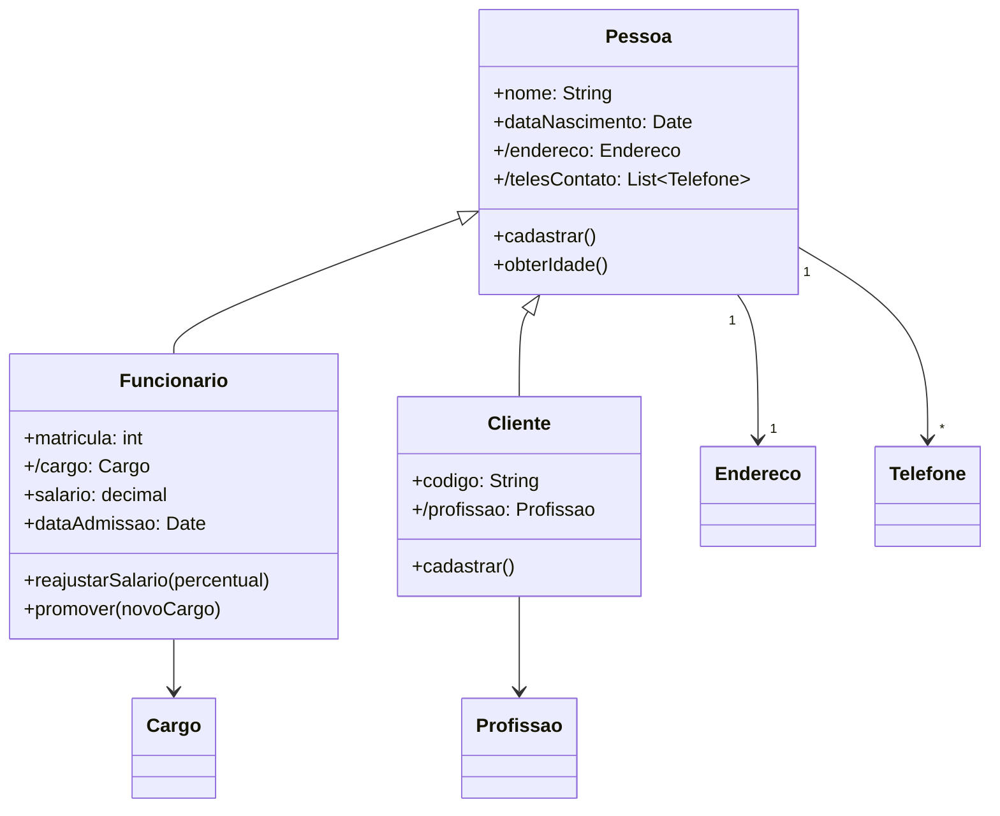

## 4. Resumo de todo o conteúdo dos arquivos

### 4.1. O que existe em cada arquivo
- **AnaliseSistemadoDiariodeJusticaEletronico2010.doc**: Exemplo completo de documentação de projeto: cliente, objetivo, recursos, cronograma, requisitos funcionais e não funcionais, casos de uso e visão do sistema de Diário Oficial Eletrônico.
- **Analise Sistema-ConcursoPublico-FATEC.doc**: Outro exemplo completo de análise de sistema, agora para concursos públicos, com requisitos, casos de uso, diagramas e arquitetura.
- **UNIPE - APS - AULA - Metodologia_Desenvolvimento_Sistemas-OO - RPROCESS.ppt**: Apresenta a metodologia RProcess: planejamento, construção, implantação e avaliação/manutenção, além dos artefatos gerados em cada fase.
- **UNIPE - APS - AULA - Metodologia Agil XP - extreme programing.ppt**: Explica agilidade e XP: valores, práticas, papéis, planejamento, iterações, TDD, refatoração, integração contínua e quando usar métodos ágeis.
- **UNIPE - Exercitando-Modelagem-UML-Desenhando-Diagramas-Classes-02 (1).doc**: Lista de minicenários para desenhar diagramas de casos de uso e diagramas de classes completos.
- **UNIPE - APS - AULA -UML-Diagrama_Classes (1).ppt**: Conceitos de diagrama de classes: classes, atributos, métodos, associação, agregação, composição, generalização, dependência e multiplicidades.
- **UNIPE - APS - AULA - Historico e Modelagem Orientada a Objetos com UML (1).ppt**: História da UML e da orientação a objetos, UML 2.0, tipos de diagramas e noções de casos de uso.
- **UNIPE- APS - AULA - UML-Diagrama_Casos_Uso- (1).ppt**: Conceitos de casos de uso: atores, casos, associação, generalização, include e extend.
- **UNIPE - Exercitando-Modelagem-UML-Identificando-Classes-Atributos-Metodos-01 (4).doc**: Lista 01 usada na avaliação: 11 exercícios focados em classes, atributos, métodos e relacionamentos.
- **UNIPE - APS - AULA - Metodologia de Levantamento de Dados (1).ppt**: Engenharia de requisitos e levantamento de dados: estudo inicial, reuniões, observação, entrevistas, questionários e organograma.
- **UNIPE - APS - AULA - O Analista no processo de desenvolvimento de software (1).ppt**: Papel do analista, ciclo de vida do software, análise, projeto, codificação, testes, manutenção e principais problemas de desenvolvimento.
- **UNIPE - Exercitando-Modelagem-UML-Identificando-Classes-Atributos-Metodos-01 (3).doc**: Cópia da Lista 01, com o mesmo foco em identificar classes, atributos, métodos e herança.
- **UNIPE - EEQS - AULA 1-  Introducao-SWEBOK - Parte I (2).ppt**: Introdução ao SWEBOK, IEEE, objetivos, áreas de conhecimento e importância para formação em engenharia de software.
- **Trabalho Analise e Projeto de Sistemas  - Prova 1 -  2026.1 (1).pdf**: Enunciado da atividade avaliativa com regras, prazo, entrega e o que deve ser produzido a partir da Lista 01.

### 4.2. Resumo da matéria

#### Papel do analista e ciclo de vida
- O analista precisa entender necessidades do usuário, o domínio do problema e alinhar o sistema aos objetivos da organização.
- O ciclo tradicional de software passa por análise, projeto, codificação, testes, instalação, operação e manutenção.
- Análise define o que o sistema deve fazer; projeto define como isso será implementado.
- Documentação, validação, manutenção e participação do usuário são pontos centrais.

#### Levantamento de dados e requisitos
- Antes de modelar, é preciso entender o negócio do cliente, a estrutura organizacional, as pessoas importantes e o problema real.
- As principais técnicas de levantamento apresentadas são reunião, entrevista, observação, questionário, brainstorming e brainwriting.
- A especificação de requisitos precisa separar requisitos funcionais e não funcionais.
- Organogramas e estudo inicial ajudam a delimitar o escopo.

#### RProcess / metodologia
- A metodologia organiza o trabalho em fases e artefatos, servindo como padrão da empresa.
- No RProcess aparecem as fases de planejamento, construção, implantação e avaliação/manutenção.
- Na construção entram refinamento de casos de uso, modelo conceitual de classes, diagramas de estados/atividades, interações, classes de projeto e testes.
- A implantação envolve homologação, produção, pacote de entrega e treinamento.

#### UML e modelagem orientada a objetos
- Modelo é uma simplificação da realidade usada para comunicação, redução de complexidade e manutenção futura.
- A UML é uma linguagem visual para modelar estrutura e comportamento do software.
- UML 2.0 amplia suporte a componentes, arquitetura, processos de negócio e tempo real.
- Diagramas estruturais e comportamentais compõem a linguagem.

#### Diagrama de classes
- Classe representa estrutura e comportamento por meio de nome, atributos e métodos.
- Os relacionamentos fundamentais vistos são associação, agregação, composição, generalização e dependência.
- Multiplicidade é indispensável para indicar quantidades entre objetos.
- A escolha entre associação, agregação e composição depende da força do vínculo todo-parte.

#### Casos de uso
- Casos de uso descrevem como atores externos interagem com o sistema e representam requisitos funcionais.
- Elementos principais: atores, casos de uso, associações, generalização, include e extend, além da fronteira do sistema.
- A descrição textual detalha fluxo principal, fluxos alternativos e exceções.
- Bons casos de uso descrevem o que o sistema faz, não como ele será implementado.

#### XP / agilidade
- Agilidade prioriza entrega rápida de valor, adaptação a mudanças e forte colaboração com o cliente.
- No XP os valores centrais são feedback, comunicação, simplicidade e coragem.
- Práticas importantes: cliente presente, jogo do planejamento, stand-up meeting, programação em pares, TDD, refatoração, integração contínua e releases curtos.
- XP funciona melhor com equipes pequenas, experientes, próximas e em ambientes com mudanças frequentes.

#### SWEBOK
- O SWEBOK organiza o corpo de conhecimento da engenharia de software.
- Ele busca dar uma visão consistente da área, apoiar currículos, certificação e formação profissional.
- O foco não é ensinar tecnologias específicas, mas o conhecimento essencial para escolhê-las adequadamente.

#### Modelos de projeto reais
- Os documentos de Diário Oficial Eletrônico e Concurso Público mostram como montar uma análise completa de sistema.
- Eles incluem identificação do cliente, objetivos, infraestrutura, cronograma, requisitos, casos de uso, diagramas e arquitetura.
- São excelentes modelos para entender como o professor espera a organização dos artefatos.

## 5. O que mais vale revisar para a prova

- Diferença entre **análise** e **projeto**.
- Como identificar **classes, atributos, métodos e relacionamentos** a partir de um texto.
- Quando usar **associação, agregação, composição e herança**.
- Como definir **multiplicidades** corretamente.
- Diferença entre **requisito funcional** e **não funcional**.
- Elementos de **casos de uso**: ator, caso, include, extend e generalização.
- Fases do **RProcess** e artefatos gerados.
- Valores e práticas do **XP**.
- Como os documentos de **Diário Oficial** e **Concurso Público** servem como modelo de análise completa.

## 6. Estratégia rápida de estudo para hoje

- Primeiro, leia a seção 'O que o trabalho pede'.
- Depois, revise as **11 questões resolvidas** da Lista 01.
- Em seguida, passe pelo resumo da matéria, principalmente UML Classes, Casos de Uso, RProcess e XP.
- Por fim, tente explicar em voz alta 3 cenários: um de cadastro simples, um com composição e um com herança.