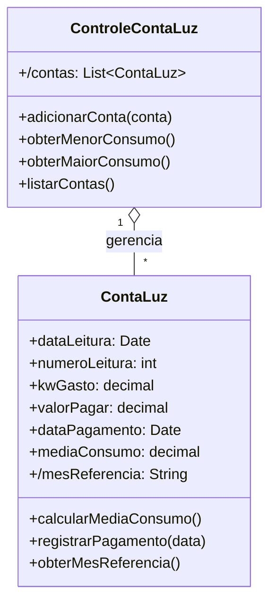

# Questão 01 - Conta de Luz

**Cenário resumido:** Controle mensal de consumo de energia de Gabriel, registrando leitura, KW gasto, valor a pagar, pagamento e média; deve permitir identificar o mês de menor e de maior consumo.

**Classes, atributos e métodos sugeridos:**

**ContaLuz**

Atributos:
- dataLeitura: Date
- numeroLeitura: Integer
- kwGasto: Decimal
- valorPagar: Decimal
- dataPagamento: Date
- mediaConsumo: Decimal
- /mesReferencia: String

Métodos:
- calcularMediaConsumo(): Decimal
- registrarPagamento(data: Date)
- obterMesReferencia(): String

**ControleContaLuz**

Atributos:
- /contas: Colecao<ContaLuz>

Métodos:
- adicionarConta(conta: ContaLuz)
- obterMenorConsumo(): ContaLuz
- obterMaiorConsumo(): ContaLuz
- listarContas(): Colecao<ContaLuz>

**Relacionamentos / observações:**
- ControleContaLuz 1 --- * ContaLuz

**Requisitos funcionais:**
- Permitir cadastrar uma conta de luz mensal.
- Permitir consultar o histórico de contas cadastradas.
- Calcular e exibir a média de consumo da conta.
- Identificar o mês de menor consumo.
- Identificar o mês de maior consumo.
- Registrar a data de pagamento da conta.

**Requisitos não funcionais:**
- Interface simples para uso pessoal.
- Precisão decimal para valores monetários e consumo.
- Persistência dos dados para consultas mensais.
- Baixo tempo de resposta para geração das consultas.

**Diagrama textual (Mermaid):**

