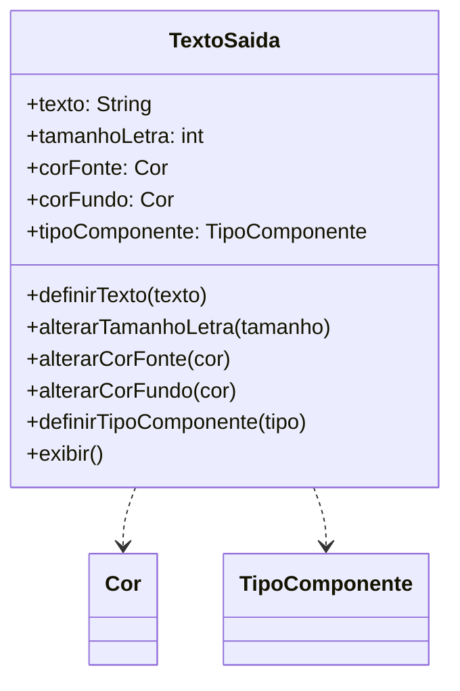

# Questão 02 - Classe TextoSaida

**Cenário resumido:** Classe para configurar um texto por atributos visuais, escolhendo tipo de componente (label, edit ou memo) e cores de fonte/fundo.

**Classes, atributos e métodos sugeridos:**

**TextoSaida**

Atributos:
- texto: String
- tamanhoLetra: Integer
- corFonte: Cor
- corFundo: Cor
- tipoComponente: TipoComponente

Métodos:
- definirTexto(texto: String)
- alterarTamanhoLetra(tamanho: Integer)
- alterarCorFonte(cor: Cor)
- alterarCorFundo(cor: Cor)
- definirTipoComponente(tipo: TipoComponente)
- exibir()

**Relacionamentos / observações:**
- TextoSaida usa os tipos enumerados Cor e TipoComponente.

**Requisitos funcionais:**
- Permitir informar o texto a ser exibido.
- Permitir configurar tamanho da letra.
- Permitir configurar cor da fonte.
- Permitir configurar cor do fundo.
- Permitir escolher o componente de exibição.
- Exibir o texto formatado conforme a configuração.

**Requisitos não funcionais:**
- Somente cores previamente definidas devem ser aceitas.
- A interface de configuração deve ser intuitiva.
- A formatação deve ser aplicada imediatamente após a alteração.

**Diagrama textual (Mermaid):**

