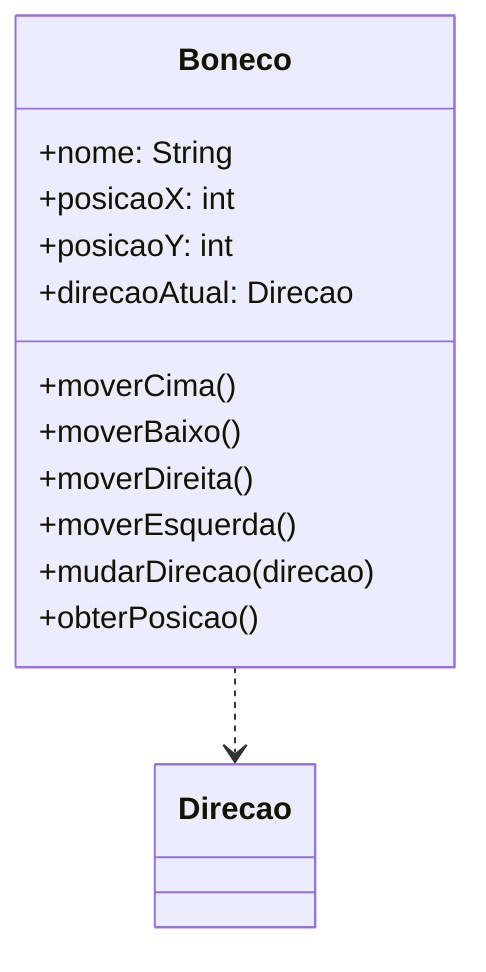

# Questão 03 - Classe Boneco em Movimento

**Cenário resumido:** Classe de um boneco com nome, posição X/Y e direção atual, capaz de se movimentar na tela.

**Classes, atributos e métodos sugeridos:**

**Boneco**

Atributos:
- nome: String
- posicaoX: Integer
- posicaoY: Integer
- direcaoAtual: Direcao

Métodos:
- moverCima()
- moverBaixo()
- moverDireita()
- moverEsquerda()
- mudarDirecao(direcao: Direcao)
- obterPosicao(): String

**Relacionamentos / observações:**
- Boneco usa o tipo enumerado Direcao.

**Requisitos funcionais:**
- Permitir definir nome do boneco.
- Permitir armazenar posição horizontal e vertical.
- Permitir alterar a direção atual.
- Permitir mover o boneco para cima, baixo, esquerda e direita.
- Permitir consultar a posição atual.

**Requisitos não funcionais:**
- Movimentação deve ser imediata.
- As direções permitidas devem ser limitadas aos quatro sentidos informados.
- A modelagem deve ser simples e reutilizável.

**Diagrama textual (Mermaid):**

