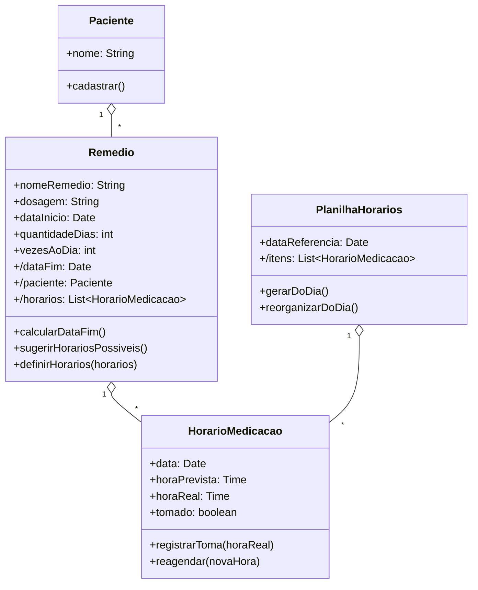

# Questão 04 - Horario de Remedios

**Cenário resumido:** Aplicação pessoal de controle de remédios com sugestão de horários, escolha do melhor horário, geração de planilha diária e reorganização em caso de atraso.

**Classes, atributos e métodos sugeridos:**

**Paciente**

Atributos:
- nome: String

Métodos:
- cadastrar()

**Remedio**

Atributos:
- nomeRemedio: String
- dosagem: String
- dataInicio: Date
- quantidadeDias: Integer
- vezesAoDia: Integer
- /dataFim: Date
- /paciente: Paciente
- /horarios: Colecao<HorarioMedicacao>

Métodos:
- calcularDataFim(): Date
- sugerirHorariosPossiveis(): Colecao<HorarioMedicacao>
- definirHorarios(horarios: Colecao<HorarioMedicacao>)

**HorarioMedicacao**

Atributos:
- data: Date
- horaPrevista: Time
- horaReal: Time
- tomado: Boolean

Métodos:
- registrarToma(horaReal: Time)
- reagendar(novaHora: Time)

**PlanilhaHorarios**

Atributos:
- dataReferencia: Date
- /itens: Colecao<HorarioMedicacao>

Métodos:
- gerarDoDia(): Colecao<HorarioMedicacao>
- reorganizarDoDia()

**Relacionamentos / observações:**
- Paciente 1 --- * Remedio
- Remedio 1 --- * HorarioMedicacao
- PlanilhaHorarios 1 --- * HorarioMedicacao

**Requisitos funcionais:**
- Permitir cadastrar o remédio, dosagem e duração do tratamento.
- Permitir informar a quantidade de vezes ao dia.
- Sugerir horários possíveis de administração.
- Permitir ao usuário escolher os horários desejados.
- Calcular automaticamente a data final do tratamento.
- Gerar planilha diária de horários.
- Reorganizar os horários do dia em caso de atraso.

**Requisitos não funcionais:**
- Aplicação deve ser adequada ao uso em smartphone.
- Horários devem ser exibidos de forma clara e legível.
- Reorganização deve ocorrer rapidamente.
- Os dados do tratamento devem permanecer salvos.

**Diagrama textual (Mermaid):**

