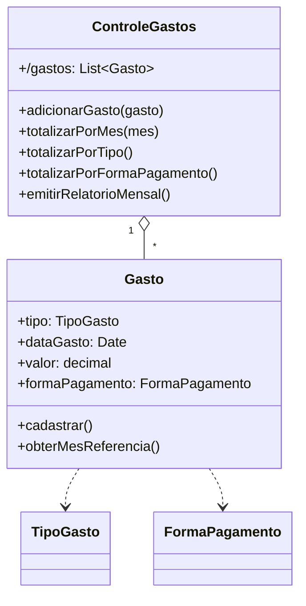

# Questão 05 - Gastos Diarios

**Cenário resumido:** Planilha de Vera para registrar gastos por tipo, data, valor e forma de pagamento; ao final do mês gera total agrupado por tipo e por forma de pagamento.

**Classes, atributos e métodos sugeridos:**

**Gasto**

Atributos:
- tipo: TipoGasto
- dataGasto: Date
- valor: Decimal
- formaPagamento: FormaPagamento

Métodos:
- cadastrar()
- obterMesReferencia(): String

**ControleGastos**

Atributos:
- /gastos: Colecao<Gasto>

Métodos:
- adicionarGasto(gasto: Gasto)
- totalizarPorMes(mes: String): Decimal
- totalizarPorTipo(): Mapa
- totalizarPorFormaPagamento(): Mapa
- emitirRelatorioMensal()

**Relacionamentos / observações:**
- ControleGastos 1 --- * Gasto

**Requisitos funcionais:**
- Permitir cadastrar um gasto diário.
- Permitir classificar o gasto por tipo.
- Permitir classificar o gasto por forma de pagamento.
- Listar os gastos de um determinado mês.
- Totalizar gastos por tipo.
- Totalizar gastos por forma de pagamento.
- Emitir relatório mensal consolidado.

**Requisitos não funcionais:**
- Valores devem usar precisão monetária.
- A consulta mensal deve ser simples.
- Os filtros por mês devem ter resposta rápida.

**Diagrama textual (Mermaid):**

