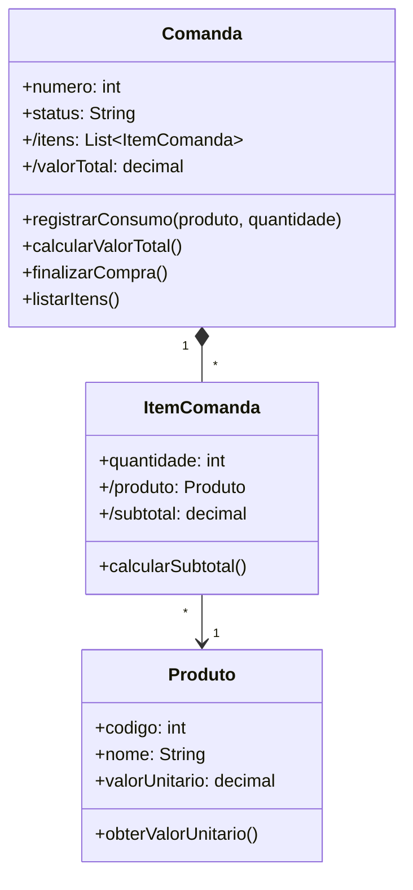

# Questão 06 - Comanda Eletronica (PDV)

**Cenário resumido:** Aplicação de padaria para registrar em uma comanda numerada os produtos consumidos e suas quantidades, finalizando a compra no caixa com cálculo do valor total.

**Classes, atributos e métodos sugeridos:**

**Produto**

Atributos:
- codigo: Integer
- nome: String
- valorUnitario: Decimal

Métodos:
- obterValorUnitario(): Decimal

**ItemComanda**

Atributos:
- quantidade: Integer
- /produto: Produto
- /subtotal: Decimal

Métodos:
- calcularSubtotal(): Decimal

**Comanda**

Atributos:
- numero: Integer
- status: String
- /itens: Colecao<ItemComanda>
- /valorTotal: Decimal

Métodos:
- registrarConsumo(produto: Produto, quantidade: Integer)
- calcularValorTotal(): Decimal
- finalizarCompra()
- listarItens()

**Relacionamentos / observações:**
- Comanda 1 --- * ItemComanda
- ItemComanda * --- 1 Produto

**Requisitos funcionais:**
- Permitir abrir uma comanda numerada.
- Permitir registrar produto e quantidade consumida.
- Permitir listar os itens registrados na comanda.
- Calcular subtotal por item.
- Calcular valor total da compra.
- Finalizar a compra no caixa.

**Requisitos não funcionais:**
- Baixo tempo de resposta no atendimento do caixa.
- Precisão monetária no cálculo dos valores.
- Facilidade de uso para atendentes e caixas.

**Diagrama textual (Mermaid):**

