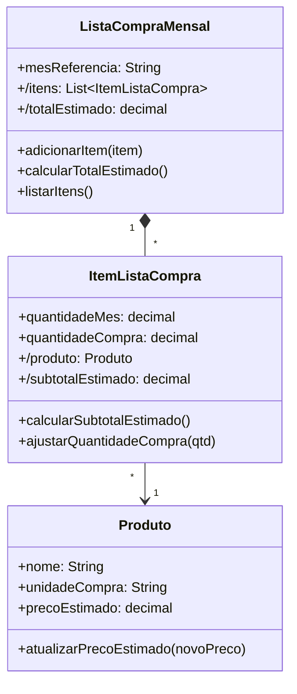

# Questão 07 - Lista de Compras

**Cenário resumido:** Lista mensal de compras de Carolina com produto, unidade, quantidade do mês, quantidade efetiva de compra e preço estimado; gera total estimado.

**Classes, atributos e métodos sugeridos:**

**Produto**

Atributos:
- nome: String
- unidadeCompra: String
- precoEstimado: Decimal

Métodos:
- atualizarPrecoEstimado(novoPreco: Decimal)

**ItemListaCompra**

Atributos:
- quantidadeMes: Decimal
- quantidadeCompra: Decimal
- /produto: Produto
- /subtotalEstimado: Decimal

Métodos:
- calcularSubtotalEstimado(): Decimal
- ajustarQuantidadeCompra(qtd: Decimal)

**ListaCompraMensal**

Atributos:
- mesReferencia: String
- /itens: Colecao<ItemListaCompra>
- /totalEstimado: Decimal

Métodos:
- adicionarItem(item: ItemListaCompra)
- calcularTotalEstimado(): Decimal
- listarItens()

**Relacionamentos / observações:**
- ListaCompraMensal 1 --- * ItemListaCompra
- ItemListaCompra * --- 1 Produto

**Requisitos funcionais:**
- Permitir cadastrar produtos da lista mensal.
- Permitir informar unidade de compra.
- Permitir registrar quantidade prevista e quantidade efetiva.
- Permitir atualizar o preço estimado do produto.
- Calcular subtotal estimado por item.
- Calcular total estimado da lista.
- Listar os itens da compra do mês.

**Requisitos não funcionais:**
- Suporte a quantidades fracionadas.
- Precisão decimal em preços e totais.
- Interface simples, adequada a uso doméstico.

**Diagrama textual (Mermaid):**

