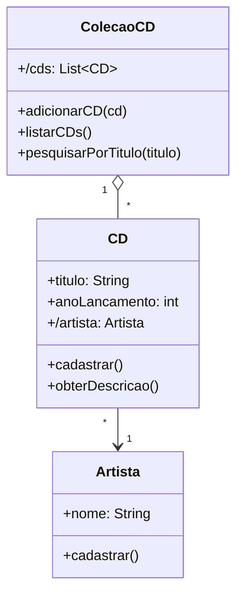

# Questão 08 - Colecao de CDs

**Cenário resumido:** Cadastro da coleção de CDs de Adriano, informando artista, título do CD e ano de lançamento.

**Classes, atributos e métodos sugeridos:**

**Artista**

Atributos:
- nome: String

Métodos:
- cadastrar()

**CD**

Atributos:
- titulo: String
- anoLancamento: Integer
- /artista: Artista

Métodos:
- cadastrar()
- obterDescricao(): String

**ColecaoCD**

Atributos:
- /cds: Colecao<CD>

Métodos:
- adicionarCD(cd: CD)
- listarCDs()
- pesquisarPorTitulo(titulo: String)

**Relacionamentos / observações:**
- ColecaoCD 1 --- * CD
- CD * --- 1 Artista

**Requisitos funcionais:**
- Permitir cadastrar artista.
- Permitir cadastrar CD com título e ano.
- Permitir associar um artista a um CD.
- Listar CDs cadastrados.
- Pesquisar CD pelo título.

**Requisitos não funcionais:**
- Cadastro simples e rápido.
- Persistência da coleção para consulta posterior.
- Ordenação e pesquisa com baixo tempo de resposta.

**Diagrama textual (Mermaid):**

