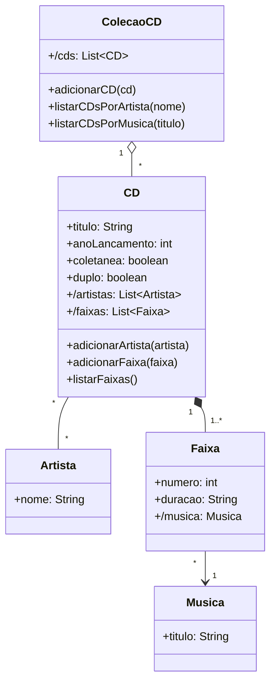

# Questão 09 - Colecao de CDs (Variacao A)

**Cenário resumido:** Coleção com CDs normais ou coletâneas, múltiplos músicos por CD, músicas/faixas e relatórios de CDs por músico e de CDs que contêm determinada música.

**Classes, atributos e métodos sugeridos:**

**Artista**

Atributos:
- nome: String

Métodos:
- cadastrar()

**Musica**

Atributos:
- titulo: String

Métodos:
- cadastrar()

**Faixa**

Atributos:
- numero: Integer
- duracao: String
- /musica: Musica

Métodos:
- cadastrar()

**CD**

Atributos:
- titulo: String
- anoLancamento: Integer
- coletanea: Boolean
- duplo: Boolean
- /artistas: Colecao<Artista>
- /faixas: Colecao<Faixa>

Métodos:
- adicionarArtista(artista: Artista)
- adicionarFaixa(faixa: Faixa)
- listarFaixas()

**ColecaoCD**

Atributos:
- /cds: Colecao<CD>

Métodos:
- adicionarCD(cd: CD)
- listarCDsPorArtista(nome: String)
- listarCDsPorMusica(titulo: String)

**Relacionamentos / observações:**
- ColecaoCD 1 --- * CD
- CD * --- * Artista
- CD 1 --- * Faixa
- Faixa * --- 1 Musica

**Requisitos funcionais:**
- Permitir cadastrar CDs com indicador de coletânea e de CD duplo.
- Permitir associar vários artistas a um CD.
- Permitir cadastrar músicas/faixas de cada CD.
- Permitir registrar a duração de cada faixa.
- Permitir listar CDs de um determinado músico.
- Permitir consultar em quais CDs está determinada música.

**Requisitos não funcionais:**
- Suporte a relacionamentos muitos-para-muitos.
- Pesquisa textual rápida por músico e música.
- Dados devem permanecer consistentes entre CD, faixa e música.

**Diagrama textual (Mermaid):**

