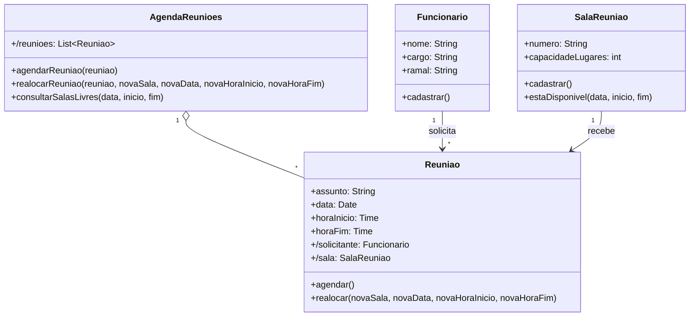

# Questão 10 - Sala de Reuniao

**Cenário resumido:** Controle de três salas de reunião, com funcionários, cargo, ramal, agendamento, realocação e consulta de salas livres por data/faixa de horário; cada sala tem capacidade.

**Classes, atributos e métodos sugeridos:**

**Funcionario**

Atributos:
- nome: String
- cargo: String
- ramal: String

Métodos:
- cadastrar()

**SalaReuniao**

Atributos:
- numero: String
- capacidadeLugares: Integer

Métodos:
- cadastrar()
- estaDisponivel(data: Date, inicio: Time, fim: Time): Boolean

**Reuniao**

Atributos:
- assunto: String
- data: Date
- horaInicio: Time
- horaFim: Time
- /solicitante: Funcionario
- /sala: SalaReuniao

Métodos:
- agendar()
- realocar(novaSala: SalaReuniao, novaData: Date, novaHoraInicio: Time, novaHoraFim: Time)

**AgendaReunioes**

Atributos:
- /reunioes: Colecao<Reuniao>

Métodos:
- agendarReuniao(reuniao: Reuniao)
- realocarReuniao(reuniao: Reuniao, novaSala: SalaReuniao, novaData: Date, novaHoraInicio: Time, novaHoraFim: Time)
- consultarSalasLivres(data: Date, inicio: Time, fim: Time): Colecao<SalaReuniao>

**Relacionamentos / observações:**
- AgendaReunioes 1 --- * Reuniao
- Funcionario 1 --- * Reuniao
- SalaReuniao 1 --- * Reuniao (ao longo do tempo)
- Restrição: uma sala só pode ter 0..1 reunião na mesma faixa de horário.

**Requisitos funcionais:**
- Permitir cadastrar salas de reunião com capacidade.
- Permitir cadastrar funcionários com cargo e ramal.
- Permitir agendar reunião com assunto, data e horário.
- Permitir associar uma reunião a uma sala e a um funcionário solicitante.
- Permitir realocar reunião, alterando sala, data e/ou horário.
- Consultar salas livres por data e faixa de horário.
- Exibir a agenda diária das salas.

**Requisitos não funcionais:**
- O sistema deve impedir conflitos de horário.
- Consultas de disponibilidade devem ser rápidas.
- Interface deve facilitar visualização da agenda por dia.
- Persistência dos agendamentos é obrigatória.

**Diagrama textual (Mermaid):**

