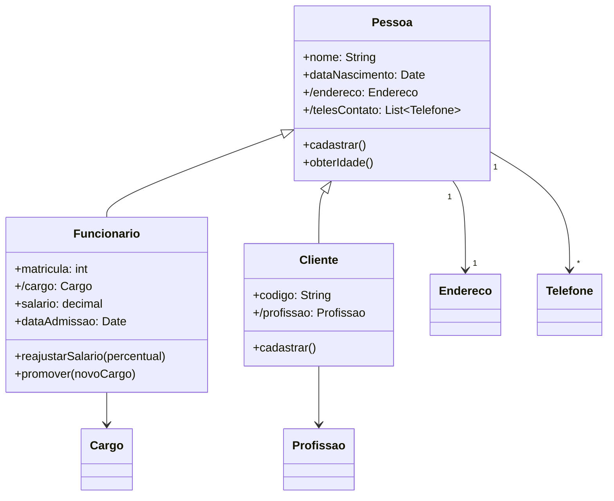

# Questão 11 - Heranca

**Cenário resumido:** Refatorar as classes Funcionario e Cliente criando uma superclasse com atributos e métodos comuns.

**Classes, atributos e métodos sugeridos:**

**Pessoa**

Atributos:
- nome: String
- dataNascimento: Date
- /endereco: Endereco
- /telesContato: Colecao<Telefone>

Métodos:
- cadastrar()
- obterIdade(): Integer

**Funcionario**

Atributos:
- matricula: Integer
- /cargo: Cargo
- salario: Decimal
- dataAdmissao: Date

Métodos:
- reajustarSalario(percentual: Decimal)
- promover(novoCargo: Cargo)

**Cliente**

Atributos:
- codigo: String
- /profissao: Profissao

Métodos:
- cadastrar()

**Relacionamentos / observações:**
- Funcionario herda de Pessoa
- Cliente herda de Pessoa
- Pessoa 1 --- 1 Endereco
- Pessoa 1 --- * Telefone

**Requisitos funcionais:**
- Permitir reutilizar os atributos comuns entre cliente e funcionário.
- Permitir calcular idade de qualquer pessoa cadastrada.
- Permitir reajustar salário do funcionário.
- Permitir promover funcionário para novo cargo.
- Permitir manter a profissão do cliente.

**Requisitos não funcionais:**
- Modelagem deve priorizar reutilização e baixo acoplamento.
- A hierarquia de herança deve ser clara e consistente.
- As subclasses devem especializar apenas o que é específico.

**Diagrama textual (Mermaid):**

